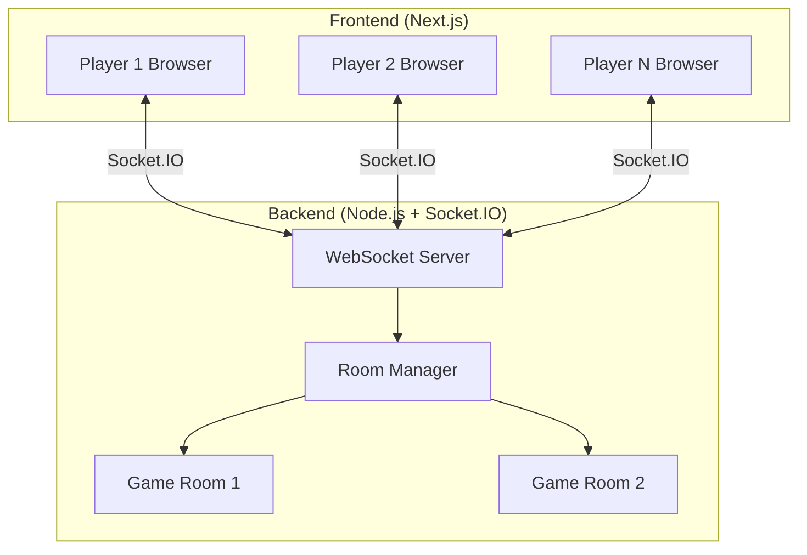
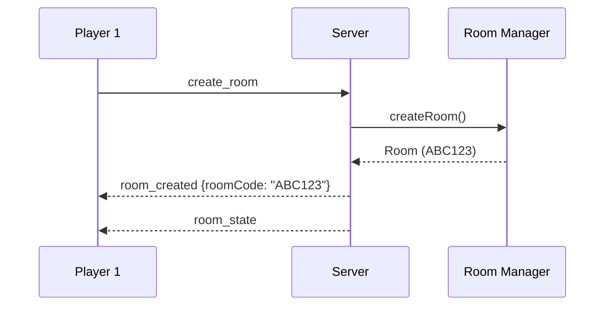
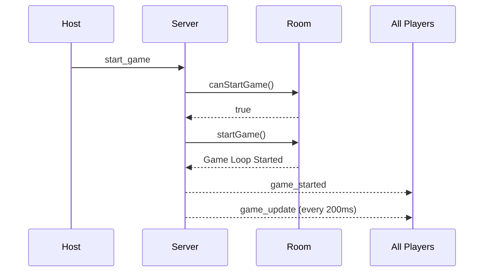
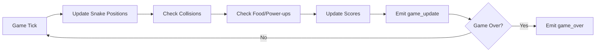
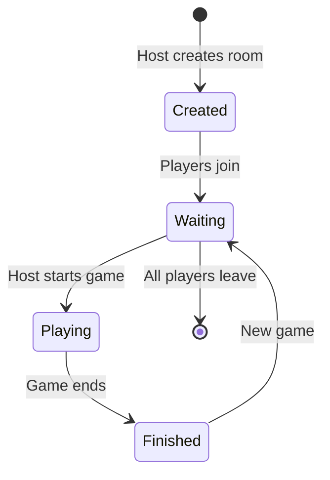

# 🎮 Multiplayer System Overview

This document explains how the real-time multiplayer system works in Jeteeah.

## Architecture

The multiplayer system uses a **client-server architecture** with WebSocket connections for real-time communication:



## Core Components

### 1. **WebSocket Server** (Socket.IO)

- Handles real-time bidirectional communication
- Manages player connections and disconnections
- Routes events to appropriate game rooms
- **Port**: 3001 (default)

### 2. **Room Manager** (Singleton)

- Creates and manages game rooms
- Generates unique 6-character room codes
- Handles player joining/leaving
- Tracks all active rooms (max 100)

### 3. **Game Room**

- Manages individual game sessions
- Runs game loop at 200ms intervals
- Handles collision detection
- Manages power-ups and food spawning
- Supports 2-8 players per room

## Game Flow

### Phase 1: Room Creation & Joining



**Steps:**

1. Player creates a room → receives unique room code (e.g., `ABC123`)
2. Other players join using the room code
3. Host sees all players in the lobby
4. Players mark themselves as "ready"

### Phase 2: Game Start



**Conditions to start:**

- Minimum 2 players in room
- All players marked as "ready"
- Room status is "waiting"

### Phase 3: Active Gameplay

The game loop runs every **200ms** (5 ticks per second):



**Each tick:**

1. Move all alive snakes based on their direction
2. Check for collisions (walls, self, other players)
3. Check if food was eaten → grow snake, increase score
4. Check if power-up was collected → apply effect
5. Broadcast updated game state to all players
6. Check win condition (only 1 player alive)

### Phase 4: Game End

**Game ends when:**

- Only 1 player remains alive (winner)
- Host manually stops the game

**Final actions:**

1. Stop game loop
2. Calculate final scores
3. Emit `game_over` event with winner and leaderboard
4. Room returns to "waiting" state

## Socket Events

### Client → Server

| Event              | Payload                  | Description            |
| ------------------ | ------------------------ | ---------------------- |
| `create_room`      | `{playerName}`           | Create a new game room |
| `join_room`        | `{roomCode, playerName}` | Join existing room     |
| `player_ready`     | -                        | Toggle ready status    |
| `start_game`       | -                        | Start game (host only) |
| `change_direction` | `{direction: {x, y}}`    | Change snake direction |
| `leave_room`       | -                        | Leave current room     |

### Server → Client

| Event               | Payload                               | Description                     |
| ------------------- | ------------------------------------- | ------------------------------- |
| `room_created`      | `{roomCode, playerId}`                | Room created successfully       |
| `room_state`        | `{roomCode, players, hostId, status}` | Current room state              |
| `player_joined`     | `{player}`                            | New player joined               |
| `player_left`       | `{playerId}`                          | Player left room                |
| `game_started`      | -                                     | Game has started                |
| `game_update`       | `{players, food, powerUps, status}`   | Game state update (every 200ms) |
| `player_eliminated` | `{playerId, playerName}`              | Player died                     |
| `game_over`         | `{winner, finalScores}`               | Game finished                   |
| `error`             | `{message}`                           | Error occurred                  |

## Game Mechanics

### Snake Movement

- **Grid Size**: 20x20
- **Speed**: 200ms per move (5 moves/second)
- **Wrap-around**: Snakes wrap to opposite side when hitting edges
- **Direction Queue**: Prevents 180° turns, queues next direction

### Collision Detection

- **Self-collision**: Snake hits its own body → eliminated
- **Player collision**: Snake hits another player → eliminated
- **Shield power-up**: Temporarily immune to collisions

### Scoring

- **Food**: +5 points per food eaten
- **Double Points**: +10 points per food (with power-up)
- **Growth**: Snake grows by 1 segment per food

### Power-Ups

Power-ups spawn randomly every **10-30 seconds** (max 3 on grid):

| Power-Up             | Effect                    | Duration   |
| -------------------- | ------------------------- | ---------- |
| 🚀 **Speed Boost**   | Faster movement           | 6 seconds  |
| 🛡️ **Shield**        | Immune to collisions      | 4 seconds  |
| ✂️ **Cut**           | Shrink by 40%, -10 points | Instant    |
| ⭐ **Double Points** | 2x points from food       | 12 seconds |

## Room Management

### Room Lifecycle



### Room Limits

- **Max Rooms**: 100 simultaneous rooms
- **Max Players**: 8 players per room
- **Min Players**: 2 players to start
- **Room Code**: 6 alphanumeric characters (e.g., `A3X9K2`)

### Auto-cleanup

- Empty rooms are automatically deleted
- If host leaves, first remaining player becomes new host
- Disconnected players are removed from room

## Frontend Integration

### Connecting to Backend

```typescript
import io from "socket.io-client";

const socket = io(process.env.NEXT_PUBLIC_API_URL); // http://localhost:3001
```

### Creating a Room

```typescript
socket.emit("create_room", { playerName: "Alice" });

socket.on("room_created", ({ roomCode, playerId }) => {
  console.log(`Room created: ${roomCode}`);
});
```

### Joining a Room

```typescript
socket.emit("join_room", {
  roomCode: "ABC123",
  playerName: "Bob",
});

socket.on("room_state", ({ players, hostId, status }) => {
  // Update UI with room state
});
```

### Controlling Snake

```typescript
// Arrow key pressed
const direction = { x: 1, y: 0 }; // Right
socket.emit("change_direction", { direction });

// Receive game updates
socket.on("game_update", ({ players, food, powerUps }) => {
  // Render game state
});
```

## Performance Considerations

### Network Optimization

- **Tick Rate**: 200ms (5 FPS) - balanced for network latency
- **State Updates**: Only changed data sent
- **Compression**: Socket.IO handles message compression

### Scalability

- **Horizontal Scaling**: Each room is independent
- **Memory**: ~1KB per player, ~10KB per room
- **CPU**: Minimal (simple collision detection)

### Latency Handling

- **Client Prediction**: Frontend predicts movement
- **Server Authority**: Server validates all actions
- **Reconciliation**: Client adjusts on mismatch

## Development

### Running Backend

```bash
# Standalone
npm run backend:dev

# With Docker
npm run docker:up
```

### Testing Multiplayer

1. Open two browser windows
2. Create room in window 1 → get room code
3. Join room in window 2 with code
4. Both players ready → start game

### Debugging

```bash
# View backend logs
npm run docker:logs backend

# Check room count
curl http://localhost:3001/api/status
```

## Security Considerations

### CORS

- Configured to allow frontend origin only
- Credentials enabled for secure cookies

### Input Validation

- Room codes validated (6 chars, alphanumeric)
- Direction changes validated (no 180° turns)
- Player limits enforced

### Rate Limiting

- Max 100 rooms prevents resource exhaustion
- Max 8 players per room

## Future Enhancements

Potential improvements:

- [ ] Spectator mode
- [ ] Private rooms with passwords
- [ ] Tournament brackets
- [ ] Replay system
- [ ] Custom game settings (speed, grid size)
- [ ] Player statistics and rankings
- [ ] Chat system
- [ ] Reconnection handling

## Troubleshooting

### Common Issues

**Connection Failed**

- Ensure backend is running on port 3001
- Check `NEXT_PUBLIC_API_URL` in `.env`
- Verify CORS settings in backend config

**Room Not Found**

- Room codes are case-insensitive
- Rooms deleted when empty
- Check room code is correct (6 chars)

**Game Won't Start**

- Need minimum 2 players
- All players must be ready
- Only host can start game

**Lag/Desync**

- Check network latency
- Reduce number of players
- Ensure stable connection

---

**For detailed backend implementation, see** [`backend/BACKEND.md`](file:///home/ayo-ola/Desktop/works/jetaahproj/jeteeah/backend/BACKEND.md)
